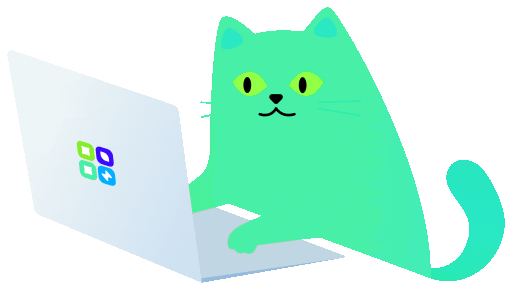

<!-- 

    

 -->

  

<h1 align="center">Hi 👋, I'm <a class="username" href="https://github.com/nguyenvuongviet"> NGUYEN VUONG VIET </a></h1>
<h3 align="center">A 4th-year Software Engineering student from 🇻🇳 HCMUTE</h3>

## 👀 Profile Views

  

## 👨‍💻 What I'm Doing:

- 🌱 I’m currently learning **Web Developer**
  <!-- - 💬 Ask me about **** -->
  <!-- - 🌐 Personal website: **<a href="">nguyenvuongviet</a>** -->
- 📫 Email me **nguyenvuongviet2k4@gmail.com**
- 📄 My CV: **<a href="https://docs.google.com/document/d/12ZQv_my1axF4oBqg-kQqIoxwvUFM4LXJ0bA9NPv3XPk/edit?usp=sharing" target="_blank">EN</a>**
<!-- / **<a href="" target="_blank">VI</a>** -->
- ⚡ Fun fact: _"I love clean code and being meticulous in every detail!"_

## 📞 Connect with me

      
      
      
      
      

## 💻 Languages, Tools I Know:

### 🌐 Front-End

    

### ⚙️ Back-End

    

### 🛠️ Tool and ...

    

## 🚀 Top Respositorys:

  
     
  </a>
     

## 📊 GitHub Insights

  

## 🔥 Streak Stats

  

## 🏆 GitHub Achievements

  

## 🧑‍🔬 Most Used Languages

  

⭐️ _Built with passion by_ [@nguyenvuongviet](https://github.com/nguyenvuongviet)
